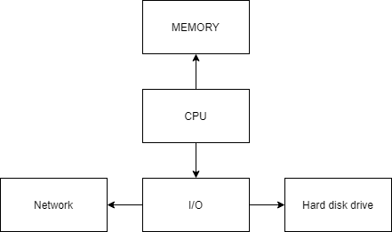

# Howto performance

This training is focused in giving you a basic set of knowledge, tooling, and methodology to solve your performance issues in Nodejs. 

Complementary articles are linked when necessary. It is assumed the reader grasped the content presented as it may be necessary to understand the discussion. 

## Basic Performance testing

We consider in this tutorial only basic performance scenarios: 
* given a test scenario representative of the external action against the system in production
* we expect all or part of the execution time of the scenario to be lower than certain threshold

It is assumed the reader is proficient in writing test, one can check test oriented websites such as:
* https://testguild.com/performance-testing-concepts-what-are-concurrent-users/

To execute the test scenario, common tools are JMeter, Gatling and countless others: 
* https://jmeter.apache.org/usermanual/best-practices.html
* https://gatling.io

Depending on test scenario and context, performance perception can be very different for each end user or system. We differentiate the execution time of a single request vs execution time of n concurrent requests. 

Note that percentile may not be enough to define SLA for a given system. 
https://theburningmonk.com/2018/10/we-can-do-better-than-percentile-latencies/

## Performance model

The following article presents the basics of web application performance:
https://dzone.com/articles/introduction-to-web-applications-performance

We executed the test.
The performance is too low
~ th execution time is too high

Why is the execution time too high ?

# Why is the execution time too high ?

To troubleshoot the execution time, we’re often using a model similar to:



CPU is either: 
* executing the code
* executing something else
* waiting

If CPU is waiting, it can wait: 
* for network data
* for hard disk data

## There is a lot of work 

CPU is executiong the code, but there is a lot of work. To improve the performance:
* is the work really necessary ? can we skip it ? 
* if not possible to skip it can we optimize the algorithm so that it’s faster ?
* if not possible to optimize, can we precompute it ?
* if not possible to precompute, can we increase the resources ? 

For various computation, memory management and cache management can have a huge impact on performance. 

## It’s doing something else 

To improve performance: 
* can we detect what else the CPU is doing ? 
* is it another process ? can we skip it ? 
* if high memory usage, can it be memory management, such as Garbage collector ? 

## It’s waiting

If CPU usage is not 100%:
* there is not enough work for the CPU
* CPU is waiting for I/O, such as network or hard disk
* CPU is waiting for something else

# Nodejs performance

NodeJS is based on the event loop. For more details:
* https://nodejs.org/en/docs/guides/event-loop-timers-and-nexttick/
* https://snyk.io/blog/nodejs-how-even-quick-async-functions-can-block-the-event-loop-starve-io/
* https://blog.insiderattack.net/event-loop-and-the-big-picture-nodejs-event-loop-part-1-1cb67a182810

These links explains in detail the event loop :
```
   ┌───────────────────────────┐
┌─>│           timers          │
│  └─────────────┬─────────────┘
│  ┌─────────────┴─────────────┐
│  │     pending callbacks     │
│  └─────────────┬─────────────┘
│  ┌─────────────┴─────────────┐
│  │       idle, prepare       │
│  └─────────────┬─────────────┘      ┌───────────────┐
│  ┌─────────────┴─────────────┐      │   incoming:   │
│  │           poll            │─────>┤  connections, │
│  └─────────────┬─────────────┘      │   data, etc.  │
│  ┌─────────────┴─────────────┐      └───────────────┘
│  │           check           │
│  └─────────────┬─────────────┘
│  ┌─────────────┴─────────────┐
└──┤      close callbacks      │
   └───────────────────────────┘
```
Diagram from https://nodejs.org/en/docs/guides/event-loop-timers-and-nexttick/

